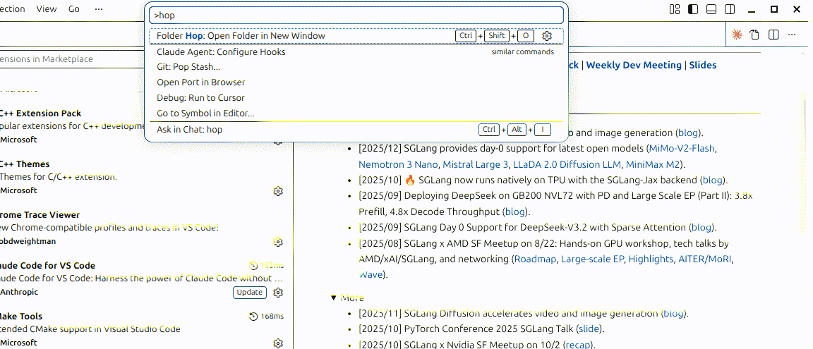

# Folder Hop

Navigate and open folders in a new VS Code window using the quick pick UI.



## Features

- Quick pick interface for browsing directories (similar to Ctrl+P for files).
- Navigate into subdirectories with Enter.
- Navigate to the parent directory with `..`.
- Open any directory in a new window with "Open this folder".
- Starts in the current workspace folder.

## Usage

Press `Ctrl+Shift+O` (`Cmd+Shift+O` on macOS) or run **Folder Hop: Open Folder in New Window** from the command palette.

## Installation

Install from the [VS Code Marketplace](https://marketplace.visualstudio.com/items?itemName=fmma.folder-hop), or install manually:

```sh
git clone https://github.com/fmma/folder-hop.git
cd folder-hop
ln -s "$(pwd)" ~/.vscode/extensions/fmma.folder-hop-0.1.0
```

Reload VS Code after installing.

## License

MIT
